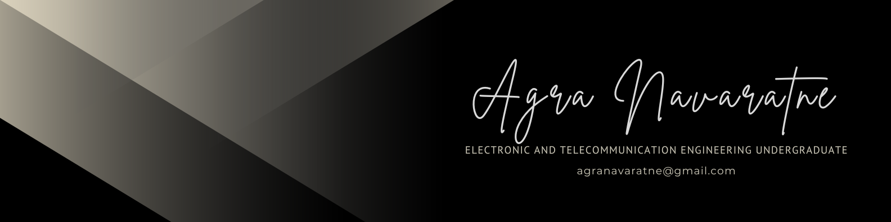

# Agra Navaratne

I’m an Electronics and Telecommunication Engineering undergraduate at the University of Moratuwa, with a passion for fusing embedded systems, AI, and hardware design to build impactful, real-world technologies. I specialize in rapid prototyping of biomedical and assistive devices — combining sensors, firmware, and mobile interfaces with a maker's mindset.

When I’m not soldering circuits or training neural networks, I’m expressing creativity through visual art and music — disciplines that inspire empathy and design thinking in my engineering journey.

---

### 🔬 Areas of Interest
- Robotics
- Machine Learning
- Biomedical Applications
- Machine Vision

---

### 📫 Let’s Connect  
💼 LinkedIn: [linkedin.com/in/agra-navaratne](https://www.linkedin.com/in/agra-navaratne)  
📧 Email: agranavaratne@gmail.com  

<!-- Optionally, add a visitor counter or GitHub stats here -->

